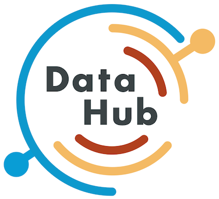

# Data Hub
[](https://travis-ci.org/linkedin/WhereHows)
[](https://gitter.im/linkedin/datahub)



## Introduction
Data Hub is Linkedin's generalized metadata search & discovery tool. To learn more about Data Hub, check out our 
[Linkedin blog post](https://engineering.linkedin.com/blog/2019/data-hub) and [Strata presentation](https://speakerdeck.com/shirshanka/the-evolution-of-metadata-linkedins-journey-strata-nyc-2019). This repository contains the complete source code to be able to build Data Hub's frontend & backend services.

## Quickstart
1. Install [docker](https://docs.docker.com/install/) and [docker-compose](https://docs.docker.com/compose/install/).
2. Clone this repo and make sure you are at the `datahub` branch.
3. Run below command to download and run all Docker containers in your local:
```
cd docker/quickstart && docker-compose pull && docker-compose up --build
```
4. After you have all Docker containers running in your machine, run below command to ingest provided sample data to Data Hub:
```
docker build -t ingestion -f docker/ingestion/Dockerfile . && cd docker/ingestion && docker-compose up
```
Note: Make sure that you're using Java 8, we have a strict dependency to Java 8 for build.

5. Finally, you can start `Data Hub` by typing `http://localhost:9001` in your browser. You can sign in with `datahub`
as username and password.

## Quicklinks
* [Docker Images](docker)
* [Frontend App](datahub-frontend)
* [Generalized Metadata Store](gms)
* [Metadata Consumer Jobs](metadata-jobs)
* [Metadata Ingestion](metadata-ingestion)

## Roadmap
1. Add user profile page
2. Deploy Data Hub to [Azure Cloud](https://azure.microsoft.com/en-us/)
