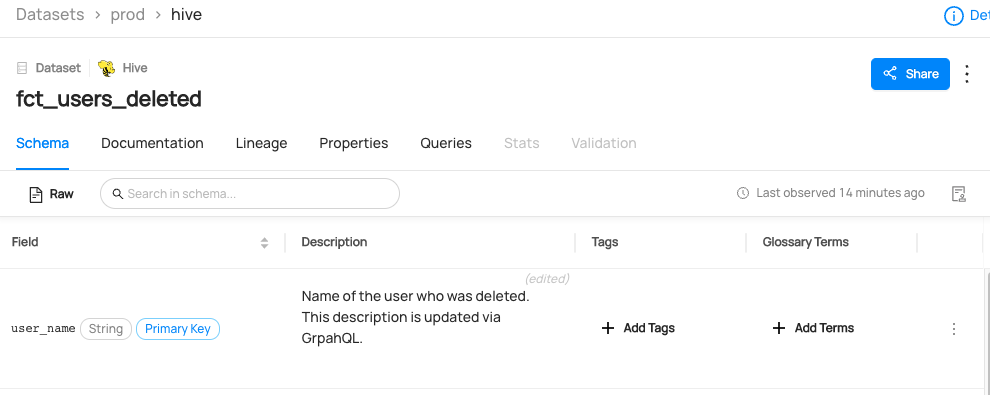

# Adding Description on Columns

## Why Would You Add Description on Columns?

Adding column descriptions(documentation) to a dataset can provide crucial context for understanding the data and its variables. This can aid in data exploration, cleaning, and analysis, as well as ensure that others can understand the data if it is shared or used in collaboration. Additionally, column descriptions can help prevent errors and misunderstandings by clearly defining the meaning and units of measurement for each variable.

### Goal Of This Guide

This guide will show you how to add a description to `user_name `column of a dataset `fct_users_deleted`.

## Prerequisites

For this tutorial, you need to deploy DataHub Quickstart and ingest sample data.
For detailed steps, please refer to [Datahub Quickstart Guide](/docs/quickstart.md).

:::note
Before adding a description, you need to ensure the targeted dataset is already present in your datahub.
If you attempt to manipulate entities that do not exist, your operation will fail.
In this guide, we will be using data from sample ingestion.
:::

In this example, we will add a description to `user_name `column of a dataset `fct_users_deleted`.

## Add Description With GraphQL

:::note
Please note that there are two available endpoints (`:8000`, `:9002`) to access `graphql`.
For more information about the differences between these endpoints, please refer to [DataHub Metadata Service](../../../metadata-service/README.md#graphql-api)
:::

### GraphQL Explorer

GraphQL Explorer is the fastest way to experiment with `graphql` without any dependencies.
Navigate to GraphQL Explorer (`http://localhost:9002/api/graphiql`) and run the following query.

```json
mutation updateDescription {
  updateDescription(
    input: {
      description: "Name of the user who was deleted. This description is updated via GrpahQL.",
      resourceUrn:"urn:li:dataset:(urn:li:dataPlatform:hive,fct_users_deleted,PROD)",
      subResource: "user_name",
      subResourceType:DATASET_FIELD
    }
  )
}
```

Note that you can use general markdown in `description`. For example, you can do the following.

```json
mutation updateDescription {
  updateDescription(
    input: {
      description: """
      ### User Name
      The `user_name` column is a primary key column that contains the name of the user who was deleted.
      """,
      resourceUrn:"urn:li:dataset:(urn:li:dataPlatform:hive,fct_users_deleted,PROD)",
      subResource: "user_name",
      subResourceType:DATASET_FIELD
    }
  )
}
```

`updateDescription` currently only supports Dataset Schema Fields, Containers.
For more information about the `updateDescription` mutation, please refer to [updateLineage](https://datahubproject.io/docs/graphql/mutations/#updateDescription).

If you see the following response, the operation was successful:

```python
{
  "data": {
    "updateDescription": true
  },
  "extensions": {}
}
```

### CURL

With CURL, you need to provide tokens. To generate a token, please refer to [Access Token Management](/docs/api/graphql/token-management.md).
With `accessToken`, you can run the following command.

```shell
curl --location --request POST 'http://localhost:8080/api/graphql' \
--header 'Authorization: Bearer <my-access-token>' \
--header 'Content-Type: application/json' \
--data-raw '{ "query": "mutation updateDescription { updateDescription ( input: { description: \"Name of the user who was deleted. This description is updated via GrpahQL.\", resourceUrn: \"urn:li:dataset:(urn:li:dataPlatform:hive,fct_users_deleted,PROD)\", subResource: \"user_name\", subResourceType:DATASET_FIELD }) }", "variables":{}}'
```

Expected Response:

```json
{ "data": { "updateDescription": true }, "extensions": {} }
```

## Add Description With Python SDK

Following code add a description to `user_name `column of a dataset `fct_users_deleted`.

```python
import logging
import time

from datahub.emitter.mce_builder import make_dataset_urn
from datahub.emitter.mcp import MetadataChangeProposalWrapper

# read-modify-write requires access to the DataHubGraph (RestEmitter is not enough)
from datahub.ingestion.graph.client import DatahubClientConfig, DataHubGraph

# Imports for metadata model classes
from datahub.metadata.schema_classes import (
    AuditStampClass,
    InstitutionalMemoryClass,
    EditableSchemaMetadataClass,
    EditableSchemaFieldInfoClass,
)

log = logging.getLogger(__name__)
logging.basicConfig(level=logging.INFO)

def get_simple_field_path_from_v2_field_path(field_path: str) -> str:
    """A helper function to extract simple . path notation from the v2 field path"""
    if not field_path.startswith("[version=2.0]"):
        # not a v2, we assume this is a simple path
        return field_path
        # this is a v2 field path
    tokens = [
        t for t in field_path.split(".") if not (t.startswith("[") or t.endswith("]"))
    ]

    return ".".join(tokens)

# Inputs -> owner, ownership_type, dataset
documentation_to_add = "Name of the user who was deleted. This description is updated via PythonSDK."
dataset_urn = make_dataset_urn(platform="hive", name="fct_users_deleted", env="PROD")
column = "user_name"
field_info_to_set = EditableSchemaFieldInfoClass(
    fieldPath=column, description=documentation_to_add
)


# Some helpful variables to fill out objects later
now = int(time.time() * 1000)  # milliseconds since epoch
current_timestamp = AuditStampClass(time=now, actor="urn:li:corpuser:ingestion")


# First we get the current owners
gms_endpoint = "http://localhost:8080"
graph = DataHubGraph(config=DatahubClientConfig(server=gms_endpoint))

current_editable_schema_metadata = graph.get_aspect(
    entity_urn=dataset_urn,
    aspect_type=EditableSchemaMetadataClass,
)


need_write = False

if current_editable_schema_metadata:
    for fieldInfo in current_editable_schema_metadata.editableSchemaFieldInfo:
        if get_simple_field_path_from_v2_field_path(fieldInfo.fieldPath) == column:
            # we have some editable schema metadata for this field
            field_match = True
            if documentation_to_add != fieldInfo.description:
                fieldInfo.description = documentation_to_add
                need_write = True
else:
    # create a brand new editable dataset properties aspect
    current_editable_schema_metadata = EditableSchemaMetadataClass(
        editableSchemaFieldInfo=[field_info_to_set],
        created=current_timestamp,
    )
    need_write = True

if need_write:
    event: MetadataChangeProposalWrapper = MetadataChangeProposalWrapper(
        entityUrn=dataset_urn,
        aspect=current_editable_schema_metadata,
    )
    graph.emit(event)
    log.info(f"Documentation added to dataset {dataset_urn}")

else:
    log.info("Documentation already exists and is identical, omitting write")


current_institutional_memory = graph.get_aspect(
    entity_urn=dataset_urn, aspect_type=InstitutionalMemoryClass
)

need_write = False
```

We're using the `MetdataChangeProposalWrapper` to change entities in this example.
For more information about the `MetadataChangeProposal`, please refer to [MetadataChangeProposal & MetadataChangeLog Events](/docs/advanced/mcp-mcl.md)

## Expected Outcomes

You can now see column description is added to `user_name` column of `fct_users_deleted`.


