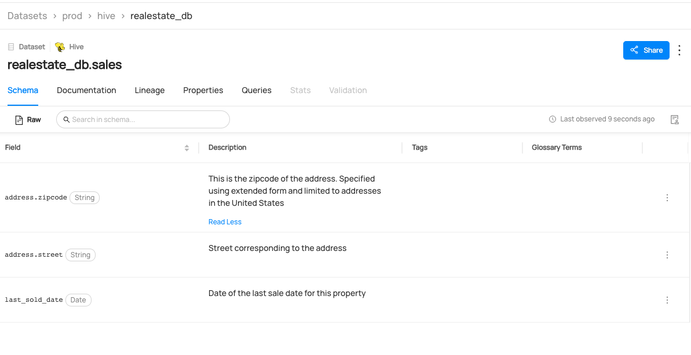

# Creating Datasets

## Why Would You Create Datasets?

The dataset entity is one the most important entities in the metadata model. They represent collections of data that are typically represented as Tables or Views in a database (e.g. BigQuery, Snowflake, Redshift etc.), Streams in a stream-processing environment (Kafka, Pulsar etc.), bundles of data found as Files or Folders in data lake systems (S3, ADLS, etc.).
For more information about datasets, refer to [Dataset](/docs/generated/metamodel/entities/dataset.md).

### Goal Of This Guide

This guide will show you how to create a dataset named `realestate_db.sales` with three columns.

## Prerequisites

For this tutorial, you need to deploy DataHub Quickstart and ingest sample data.
For detailed steps, please refer to [Datahub Quickstart Guide](/docs/quickstart.md).

## Create Datasets With GraphQL (Not Supported)

> 🚫 Creating a dataset via `graphql` is currently not supported.
> Please check out [API feature comparison table](/docs/api/datahub-apis.md#datahub-api-comparison) for more information,

## Create Datasets With Python SDK

The following code creates a hive dataset named `realestate_db.sales` with three fields.
You can refer to the complete code in [dataset_schema.py](https://github.com/datahub-project/datahub/blob/master/metadata-ingestion/examples/library/dataset_schema.py).

```python
# inlined from metadata-ingestion/examples/library/dataset_schema.py
# Imports for urn construction utility methods
from datahub.emitter.mce_builder import make_data_platform_urn, make_dataset_urn
from datahub.emitter.mcp import MetadataChangeProposalWrapper
from datahub.emitter.rest_emitter import DatahubRestEmitter

# Imports for metadata model classes
from datahub.metadata.schema_classes import (
    AuditStampClass,
    DateTypeClass,
    OtherSchemaClass,
    SchemaFieldClass,
    SchemaFieldDataTypeClass,
    SchemaMetadataClass,
    StringTypeClass,
)

event: MetadataChangeProposalWrapper = MetadataChangeProposalWrapper(
    entityUrn=make_dataset_urn(platform="hive", name="realestate_db.sales", env="PROD"),
    aspect=SchemaMetadataClass(
        schemaName="customer",  # not used
        platform=make_data_platform_urn("hive"),  # important <- platform must be an urn
        version=0,  # when the source system has a notion of versioning of schemas, insert this in, otherwise leave as 0
        hash="",  # when the source system has a notion of unique schemas identified via hash, include a hash, else leave it as empty string
        platformSchema=OtherSchemaClass(rawSchema="__insert raw schema here__"),
        lastModified=AuditStampClass(
            time=1640692800000, actor="urn:li:corpuser:ingestion"
        ),
        fields=[
            SchemaFieldClass(
                fieldPath="address.zipcode",
                type=SchemaFieldDataTypeClass(type=StringTypeClass()),
                nativeDataType="VARCHAR(50)",  # use this to provide the type of the field in the source system's vernacular
                description="This is the zipcode of the address. Specified using extended form and limited to addresses in the United States",
                lastModified=AuditStampClass(
                    time=1640692800000, actor="urn:li:corpuser:ingestion"
                ),
            ),
            SchemaFieldClass(
                fieldPath="address.street",
                type=SchemaFieldDataTypeClass(type=StringTypeClass()),
                nativeDataType="VARCHAR(100)",
                description="Street corresponding to the address",
                lastModified=AuditStampClass(
                    time=1640692800000, actor="urn:li:corpuser:ingestion"
                ),
            ),
            SchemaFieldClass(
                fieldPath="last_sold_date",
                type=SchemaFieldDataTypeClass(type=DateTypeClass()),
                nativeDataType="Date",
                description="Date of the last sale date for this property",
                created=AuditStampClass(
                    time=1640692800000, actor="urn:li:corpuser:ingestion"
                ),
                lastModified=AuditStampClass(
                    time=1640692800000, actor="urn:li:corpuser:ingestion"
                ),
            ),
        ],
    ),
)

# Create rest emitter
rest_emitter = DatahubRestEmitter(gms_server="http://localhost:8080")
rest_emitter.emit(event)

```

We're using the `MetdataChangeProposalWrapper` to change entities in this example.
For more information about the `MetadataChangeProposal`, please refer to [MetadataChangeProposal & MetadataChangeLog Events](/docs/advanced/mcp-mcl.md)

## Expected Outcomes

You can now see `realestate_db.sales` dataset has been created.



## What's Next?

Now that you created a dataset, how about enriching it? Here are some guides that you can check out.

- [how to add a tag on a dataset](/docs/api/tutorials/adding-tags.md).
- [how to add a term on a dataset](/docs/api/tutorials/adding-terms.md).
- [how to add owner on a dataset](/docs/api/tutorials/adding-ownerships.md).
- [how to add lineage on a dataset](/docs/api/tutorials/adding-lineage.md).
