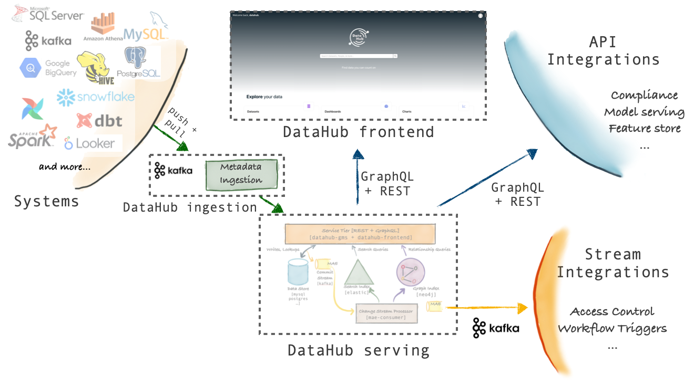

# DataHub Architecture Overview

We highly recommend that you read the excellent [metadata architectures blog post] that describes the three generations of metadata architectures, and goes into a 
lot of detail around the motivations and evolution of the DataHub architecture in comparison with other data discovery solutions and catalogs.

The figure below describes the high-level architecture of DataHub, a third-generation metadata platform.

## The Components
The DataHub deployables are split into three components:

### Ingestion
This component controls how metadata is integrated with DataHub. Read [datahub-ingestion] to learn more.

### Serving
The component is responsible for storing and querying data within DataHub. Read [datahub-serving] to learn more. 

### Frontend
This is the user-facing application that powers search and discovery over the metadata graph. Read [react-frontend] to learn more. 

## Architecture Highlights
There are three main highlights of DataHub's architecture. 

### Schema-first approach to Metadata Modeling
DataHub's metadata model is described using a [serialization agnostic language](https://linkedin.github.io/rest.li/pdl_schema). Both [REST](../../gms) and well as [GraphQL API-s](../../datahub-web-react/src/graphql) are supported. In addition, DataHub supports an [AVRO-based API](../../metadata-events) over Kafka to communicate metadata changes and subscribe to them. Our [roadmap](../roadmap.md) includes a milestone to support no-code metadata model edits very soon, which will allow for even more ease of use, while retaining all the benefits of a typed API. Read about metadata modeling at [metadata modeling].
### Stream-based Real-time Metadata Platform
DataHub's metadata infrastructure is stream-oriented, which allows for changes in metadata to be communicated and reflected within the platform within seconds. You can also subscribe to changes happening in DataHub's metadata, allowing you to build real-time metadata-driven systems. For example, you can build an access-control system that can observe a previously world-readable dataset adding a new schema field which contains PII, and locks down that dataset for access control reviews.
### Federated Metadata Serving
DataHub comes with a single [metadata service (gms)](../../gms) as part of the open source repository. However, it also supports federated metadata services which can be owned and operated by different teams –– in fact that is how LinkedIn runs DataHub internally. The federated services communicate with the central search index and graph using Kafka, to support global search and discovery while still enabling decoupled ownership of metadata. This kind of architecture is very amenable for companies who are implementing [data mesh](https://martinfowler.com/articles/data-monolith-to-mesh.html).

[metadata modeling]: ../how/metadata-modelling.md
[PDL]: https://linkedin.github.io/rest.li/pdl_schema
[metadata architectures blog post]: https://engineering.linkedin.com/blog/2020/datahub-popular-metadata-architectures-explained
[datahub-serving]: metadata-serving.md
[datahub-ingestion]: metadata-ingestion.md
[react-frontend]: ../../datahub-web-react/README.md
