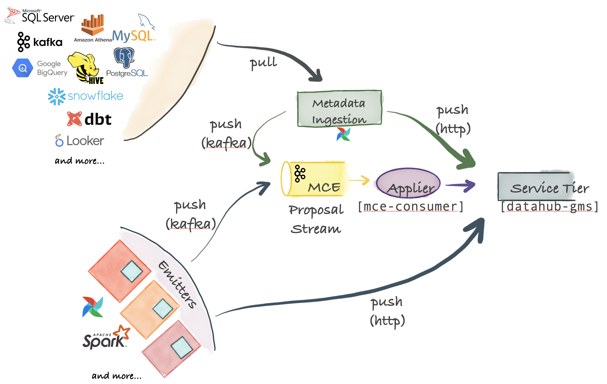

# Metadata Ingestion Architecture

DataHub supports an extremely flexible ingestion architecture that can support push, pull, asynchronous and synchronous models. 
The figure below describes all the options possible for connecting your favorite system to DataHub. 

## MCE: The Center Piece 

The center piece for ingestion is the [Metadata Change Event (MCE)] which represents a metadata change that is being communicated by an upstream system. 
MCE-s can be sent over Kafka, for highly scalable async publishing from source systems. They can also be sent directly to the HTTP endpoint exposed by the DataHub service tier to get synchronous success / failure responses. 

## Pull-based Integration

DataHub ships with a Python based [metadata-ingestion system](../../metadata-ingestion/README.md) that can connect to different sources to pull metadata from them. This metadata is then pushed via Kafka or HTTP to the DataHub storage tier. Metadata ingestion pipelines can be [integrated with Airflow](../../metadata-ingestion/README.md#lineage-with-airflow) to set up scheduled ingestion or capture lineage. If you don't find a source already supported, it is very easy to [write your own](../../metadata-ingestion/README.md#contributing).

## Push-based Integration

As long as you can emit a [Metadata Change Event (MCE)] event to Kafka or make a REST call over HTTP, you can integrate any system with DataHub. For convenience, DataHub also provides simple [Python emitters] for you to integrate into your systems to emit metadata changes (MCE-s) at the point of origin.

## Internal Components

### Applying MCE-s to DataHub Service Tier (mce-consumer)

DataHub comes with a Kafka Streams based job, [mce-consumer-job], which consumes the MCE-s and converts them into the [equivalent Pegasus format] and sends it to the DataHub Service Tier (datahub-gms) using the `/ingest` endpoint. 

[Metadata Change Event (MCE)]: ../what/mxe.md#metadata-change-event-mce
[Metadata Audit Event (MAE)]: ../what/mxe.md#metadata-audit-event-mae
[MAE]: ../what/mxe.md#metadata-audit-event-mae
[equivalent Pegasus format]: https://linkedin.github.io/rest.li/how_data_is_represented_in_memory#the-data-template-layer
[mce-consumer-job]: ../../metadata-jobs/mce-consumer-job
[Python emitters]: ../../metadata-ingestion/README.md#using-as-a-library

