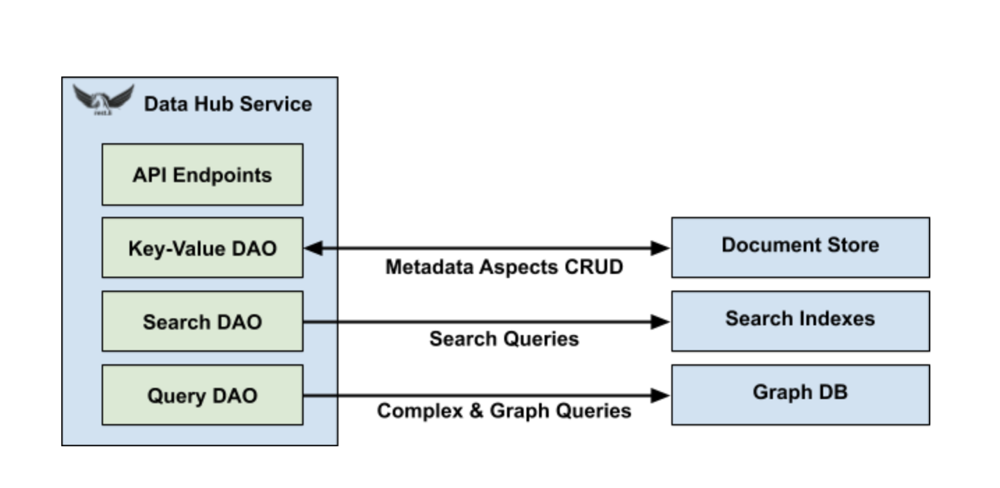

# Metadata Serving Architecture

This section describes how metadata is served in GMA. In particular, it demonstrates how GMA can efficiently service different types of queries, including key-value, complex queries, and full text search.
Below shows a high-level system diagram for the metadata serving architecture.



There are four types of Data Access Object ([DAO]) that standardize the way metadata is accessed. 
This section describes each type of DAO, its purpose, and the interface. 

These DAOs rely heavily on [Java Generics](https://docs.oracle.com/javase/tutorial/extra/generics/index.html) so that the core logics can remain type-neutral. 
However, as there’s no inheritance in [Pegasus], the generics often fallback to extending [RecordTemplate] instead of the desired types (i.e. [entity], [relationship], metadata [aspect] etc). Additionl runtime type checking has been added to the DAOs to avoid binding to unexpected types. We also cache the type checking reulst to minimize runtime overhead.

## Key-value DAO (Local DAO)

[GMS] use [Local DAO] to store and retrieve metadata [aspect]s from the local document store. 
Below shows the base class and its simple key-value interface. 
As the DAO is a generic class, it needs to be bound to specific type during instantiation. 
Each entity type will need to instantiate its own version of DAO.

```java
public abstract class BaseLocalDAO<ASPECT extends UnionTemplate> {

 public abstract <URN extends Urn, METADATA extends RecordTemplate> void 
  add(Class<METADATA> type, URN urn, METADATA value);

 public abstract <URN extends Urn, METADATA extends RecordTemplate> 
  Optional<METADATA> get(Class<METADATA> type, URN urn, int version);

 public abstract <URN extends Urn, METADATA extends RecordTemplate> 
  ListResult<Integer> listVersions(Class<METADATA> type, URN urn, int start, 
    int pageSize);

 public abstract <METADATA extends RecordTemplate> ListResult<Urn> listUrns( 
  Class<METADATA> type, int start, int pageSize);

 public abstract <URN extends Urn, METADATA extends RecordTemplate> 
  ListResult<METADATA> list(Class<METADATA> type, URN urn, int start, int pageSize);
}
```

Another important function of [Local DAO] is to automatically emit [MAE]s whenever the metadata is updated. 
This is doable because MAE effectively use the same [Pegasus] models so [RecordTemplate] can be easily converted into the corresponding [GenericRecord].

## Search DAO

Search DAO is also a generic class that can be bound to a specific type of search document. 
The DAO provides 3 APIs:
* A `search` API that takes the search input, a [Filter], a [SortCriterion], some pagination parameters, and returns a [SearchResult]. 
* An `autoComplete` API which allows typeahead-style autocomplete based on the current input and a [Filter], and returns [AutocompleteResult].
* A `filter` API which allows for filtering only without a search input. It takes a a [Filter] and a [SortCriterion] as input and returns [SearchResult].

```java
public abstract class BaseSearchDAO<DOCUMENT extends RecordTemplate> {

  public abstract SearchResult<DOCUMENT> search(String input, Filter filter, 
        SortCriterion sortCriterion, int from, int size);

  public abstract AutoCompleteResult autoComplete(String input, String field,
        Filter filter, int limit);

  public abstract SearchResult<DOCUMENT> filter(Filter filter, SortCriterion sortCriterion, 
        int from, int size);
}
```

## Query DAO

Query DAO allows clients, e.g. [GMS](../what/gms.md), [MAE Consumer Job](metadata-ingestion.md#mae-consumer-job) etc, to perform both graph & non-graph queries against the metadata graph. 
For instance, a GMS can use the Query DAO to find out “all the dataset owned by the users who is part of the group `foo` and report to `bar`,” which naturally translates to a graph query. 
Alternatively, a client may wish to retrieve “all the datasets that stored under /jobs/metrics”, which doesn’t involve any graph traversal.

Below is the base class for Query DAOs, which contains the `findEntities` and `findRelationships` methods. 
Both methods also have two versions, one involves graph traversal, and the other doesn’t. 
You can use `findMixedTypesEntities` and `findMixedTypesRelationships` for queries that return a mixture of different types of entities or relationships. 
As these methods return a list of [RecordTemplate], callers will need to manually cast them back to the specific entity type using [isInstance()](https://docs.oracle.com/javase/8/docs/api/java/lang/Class.html#isInstance-java.lang.Object-) or reflection.

Note that the generics (ENTITY, RELATIONSHIP) are purposely left untyped, as these types are native to the underlying graph DB and will most likely differ from one implementation to another.

```java
public abstract class BaseQueryDAO<ENTITY, RELATIONSHIP> {

 public abstract <ENTITY extends RecordTemplate> List<ENTITY> findEntities(
  Class<ENTITY> type, Filter filter, int offset, int count);

 public abstract <ENTITY extends RecordTemplate> List<ENTITY> findEntities(
  Class<ENTITY> type, Statement function);

 public abstract List<RecordTemplate> findMixedTypesEntities(Statement function);

 public abstract <ENTITY extends RecordTemplate, RELATIONSHIP extends RecordTemplate> List<RELATIONSHIP> 
  findRelationships(Class<ENTITY> entityType, Class<RELATIONSHIP> relationshipType, Filter filter, int offset, int count);

 public abstract <RELATIONSHIP extends RecordTemplate> List<RELATIONSHIP> 
  findRelationships(Class<RELATIONSHIP> type, Statement function);

 public abstract List<RecordTemplate> findMixedTypesRelationships(
  Statement function);
}
```

## Remote DAO

[Remote DAO] is nothing but a specialized readonly implementation of [Local DAO]. 
Rather than retrieving metadata from a local storage, Remote DAO will fetch the metadata from another [GMS]. 
The mapping between [entity] type and GMS is implemented as a hard-coded map.

To prevent circular dependency ([rest.li] service depends on remote DAO, which in turn depends on rest.li client generated by each rest.li service), 
Remote DAO will need to construct raw rest.li requests directly, instead of using each entity’s rest.li request builder.


[AutocompleteResult]: ../../metadata-dao/src/main/pegasus/com/linkedin/metadata/query/AutoCompleteResult.pdsc
[Filter]: ../../metadata-dao/src/main/pegasus/com/linkedin/metadata/query/Filter.pdsc
[SortCriterion]: ../../metadata-dao/src/main/pegasus/com/linkedin/metadata/query/SortCriterion.pdsc
[SearchResult]: ../../metadata-dao/src/main/java/com/linkedin/metadata/dao/SearchResult.java
[RecordTemplate]: https://github.com/linkedin/rest.li/blob/master/data/src/main/java/com/linkedin/data/template/RecordTemplate.java
[GenericRecord]: https://github.com/apache/avro/blob/master/lang/java/avro/src/main/java/org/apache/avro/generic/GenericRecord.java
[DAO]: https://en.wikipedia.org/wiki/Data_access_object
[Pegasus]: https://linkedin.github.io/rest.li/DATA-Data-Schema-and-Templates
[relationship]: ../what/relationship.md
[entity]: ../what/entity.md
[aspect]: ../what/aspect.md
[GMS]: ../what/gms.md
[Local DAO]: ../../metadata-dao/src/main/java/com/linkedin/metadata/dao/BaseLocalDAO.java
[Remote DAO]: ../../metadata-dao/src/main/java/com/linkedin/metadata/dao/BaseRemoteDAO.java
[MAE]: ../what/mxe.md#metadata-audit-event-mae
[rest.li]: https://rest.li
