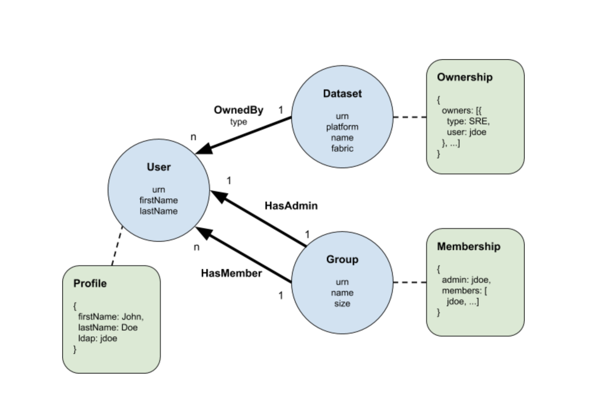

# How to model metadata?

[GMA](../what/gma.md) uses [rest.li](https://rest.li), which is LinkedIn's open source REST framework. All metadata in GMA needs to be modelled using [Pegasus schema (PDL)](https://linkedin.github.io/rest.li/pdl_schema) which is the data schema for [rest.li](https://rest.li).

Conceptually we’re modelling metadata as a hybrid graph of nodes ([entities](../what/entity.md)) and edges ([relationships](../what/relationship.md)), with additional documents ([metadata aspects](../what/aspect.md)) attached to each node. You can also think of it as a modified [Entity-Relationship Model](https://en.wikipedia.org/wiki/Entity%E2%80%93relationship_model). 

Here is an example graph consisting of 3 types of entities (`User`, `Group`, `Dataset`), 3 types of relationships (`OwnedBy`, `HasAdmin`, `HasMember`), and 3 types of metadata aspects (`Ownership`, `Profile`, and `Membership`).

